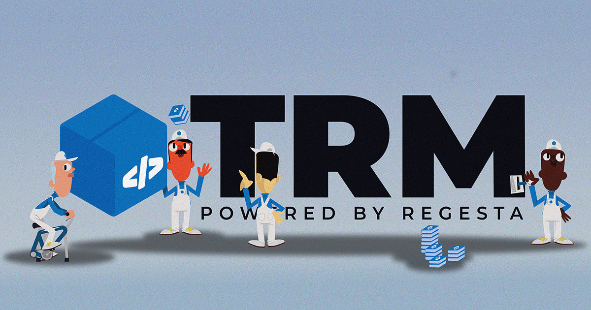

# TRM - Transport Request Manager

| 🚀 This project is funded and maintained by 🏦 | 🔗                                                             |
|-------------------------------------------------|----------------------------------------------------------------|
| Regesta S.p.A.                                  | [https://www.regestaitalia.eu/](https://www.regestaitalia.eu/) |
| Clarex S.r.l.                                   | [https://www.clarex.it/](https://www.clarex.it/)               |

> **Current Stage**: Stage 3 – ✅ **Production**. Learn more about the [TRM Registry Roadmap](/registry/public/roadmap.md).

**TRM (Transport Request Manager)** is a modern DevOps-inspired solution that makes managing ABAP transports between **SAP ECC** and **S/4HANA On-Premise** systems simple, reliable, and scalable.

  

TRM introduces **package-based software delivery** to the SAP ecosystem, bringing with it semantic versioning, dependency management, and automated deployment activities — all driven by a structured, system-validated manifest.

---

## What is TRM?

TRM is a complete toolchain that transforms how custom ABAP developments are published, installed, and maintained across SAP landscapes. Inspired by modern package managers, TRM introduces a declarative, version-controlled, and automated way to manage your SAP transports.

TRM enables you to:

- **Define a manifest** for each ABAP package (similar to `package.json` or `pom.xml`)
- **Version your developments** semantically ([SemVer](https://semver.org/) compliance)
- **Declare and verify dependencies** — including other TRM packages, SAP standard objects, and customizing data
- **Automate post-install activities**, such as client dependant customizing, cache invalidation etc.
- **Validate system requirements** prior to installation
- **Compare versions** of a package across multiple SAP systems
- **Distribute** your developments via:
  - Cloud registries (e.g., [trmregistry.com](https://trmregistry.com) or private registry)
  - Local `.trm` files for offline installations

---

## Key Features

### 🚀 Modern Delivery for ABAP

- Publish ABAP packages from a **central reference system**
- Deliver packages to target systems (outside of the original landscape) using a single command via the TRM CLI
- Full support for **Workbench objects**, **Customizing**, and **Translations**

### 📦 Structured Manifest

Each package includes a `manifest.json` that declares:

- Version and metadata
- System requirements
- Dependencies
- Post-install scripts
- Author and license information

### 🔄 End-to-End Package Lifecycle

- **Publish** from a central system
- **Store** in a registry (cloud or local)
- **Install** on target SAP systems (outside of the original landscape) with full dependency and requirement validation
- **Persist** manifest entries in the system for version comparisons and auditability

### ⚙️ Powerful Integrations

- Exposes both **REST APIs** and **RFC-enabled modules** for integration and automation
- Native support for **GitHub Actions** and **AbapGit**
- Can be fully integrated in CI/CD pipelines for **automatic publishing and installation**

---

## Architecture Overview

To use TRM, you must set up the following components:

- [**Client**](client/README.md): Command-line interface (CLI) for interacting with TRM
- [**Server**](server/README.md): SAP backend interface (via RFC)
- [**Registry**](registry/README.md): Package storage and distribution

> If you only want to test TRM or see it in action, head over to the [**Getting Started**](getting-started.md) section.

---

## Use with the Public or Private Registry

TRM is preconfigured to work with the [**Public Registry**](https://trmregistry.com), no setup required.

If you need full control or private distribution, you can also host your own registry. See the [registry documentation](registry/README.md) for instructions.

Want to integrate directly with the Public Registry?  
Explore the [Public Registry API](/registry/public/api.md).

# Contributors

<!-- {docsify-add CONTRIBUTORS} -->

 <!-- {docsify-remove} -->
