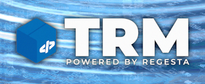

# 🚚 TRM (Transport Request Manager)

| 🚀 This project is funded and maintained by 🏦 | 🔗                                                             |
|-------------------------------------------------|----------------------------------------------------------------|
| Regesta S.p.A.                                  | [https://www.regestaitalia.eu/](https://www.regestaitalia.eu/) |
| Clarex S.r.l.                                   | [https://www.clarex.it/](https://www.clarex.it/)               |

**TRM (Transport Request Manager)** is a package manager inspired solution built leveraging CTS that simplifies SAP ABAP transports.

  

TRM introduces **package-based software delivery** to the SAP ecosystem, bringing with it semantic versioning, dependency management, and automated deployment activities.

---

# What is TRM?

TRM is a software that transforms how custom ABAP developments are published, installed, and maintained across SAP landscapes.
Inspired by modern package managers, TRM introduces a declarative, version-controlled, and automated way to manage your SAP transports.

With TRM, you can:

- **Define a manifest** for each ABAP package (similar to `package.json` with Node.js or `pom.xml` with Maven)
- **Version your products** ([SemVer](https://semver.org/) compliance)
- **Declare dependencies** (to other TRM packages, SAP standard objects, or customizing data)
- **Automate post-install activities**, such as client dependant customizing, cache invalidation etc.
- **Validate system requirements** prior to installation
- **Compare versions** of the same product across multiple SAP systems (in or outside the same landscape)
- **Distribute** your product release to the public or to a restricted number of users:
  - Registry (e.g., [trmregistry.com](https://trmregistry.com) or private registry)
  - Local `.trm` files for offline installations

## Modern approach for ABAP

- Publish ABAP packages from a **central development system**
- Deliver packages to target systems (outside of the original landscape e.g. customers development system) using a single CLI command (or in a pipeline)
- Full support for **workbench objects**, **customizing**, and **translations**

## Structured Manifest

Each package includes a `manifest.json` that declares:

- Version and metadata
- System requirements
- Dependencies
- Post-install scripts

---

# Architecture Overview

- [**Server**](https://github.com/RegestaItalia/trm-server): Collection of APIs installed on source and destination systems
- [**Client**](https://github.com/RegestaItalia/trm-client): Command-line interface that talks with SAP instances
- [**Registry**](https://trmregistry.com/): Cloud registry where package releases are safely stored for end users to install

---

# Business cases

## Managing core developments across SAP customers

SAP partners usually maintain a set of **core developments** that are reused across multiple customer systems.\
These developments typically include shared frameworks, utilities, integrations, logging libraries, or industry-specific functionality that must be **imported and kept up to date in every customer landscape**.

### Before TRM

Traditionally, distributing these developments required **manual transport management** or ad-hoc solutions. When a new customer project started, the partner had to:

- Export transport files containing the core developments.
- Import them into the customer's development system landscape.
- Manually execute some post import activities
- Repeat this process whenever updates or bug fixes were released.

This approach introduced several challenges:

- **Manual and error-prone distribution** of shared components.
- **Difficult (if not impossible) version tracking** across different customers.
- **Complex dependency management** between internal libraries.
- **Time consuming** activities.

As the number of customers increases, maintaining these shared developments becomes progressively more complex and time-consuming...

### With TRM

TRM introduces a **package registry and dependency management model for ABAP developments**, allowing SAP partners to treat their core developments as **versioned packages**.

Instead of manually transporting shared code, the partner can:

1. **Publish core libraries as TRM packages** in a registry.
2. Assign proper **semantic versions** to each release.
3. Declare **dependencies** between packages.

When a new customer system is set up, developers simply **install the required packages from the registry**.\
TRM automatically:

- Resolves dependencies.
- Installs compatible versions.
- Executes the necessary post activities

Updating shared developments becomes straightforward: the partner publishes a new version, and customer systems can **upgrade in a controlled and traceable way**.\
What was once a time consuming and error prone activity, becomes a **simple command**.

### TRM in the Development Lifecycle

TRM integrates naturally into the lifecycle of ABAP developments:

1. **Development**  
   Core functionality is developed and maintained in the partner's **central development system**.

2. **Packaging and Release**  
   Once validated, a new version of the package is published to the TRM registry.

3. **Consumption**  
   A package with a specific semantic version is always available and ready to install.

4. **Updates and Maintenance**  
   Bug fixes or new features are released as new package versions. Customer systems can upgrade when appropriate.

This process enables a **structured and automated distribution model**, similar to modern package ecosystems.

### The Result

| Before TRM | After TRM |
|-------------|-----------|
| Manual transport imports | Automated package installation |
| Difficult version tracking | Clear semantic versioning |
| Inconsistent customer systems | Reproducible installations |
| Manual dependency handling | Automatic dependency resolution |
| Time-consuming updates | Controlled upgrades |

---

# Contributors

Like every other TRM open-source projects, contributions are always welcomed ❤️. <!-- {docsify-remove} -->

Make sure to open an issue first. <!-- {docsify-remove} -->

Contributions will be merged upon approval. <!-- {docsify-remove} -->

[Click here](https://docs.trmregistry.com/#/CONTRIBUTING) for the full list of TRM contribution guidelines. <!-- {docsify-remove} -->

<!-- {docsify-add CONTRIBUTORS} -->
 <!-- {docsify-remove} -->
