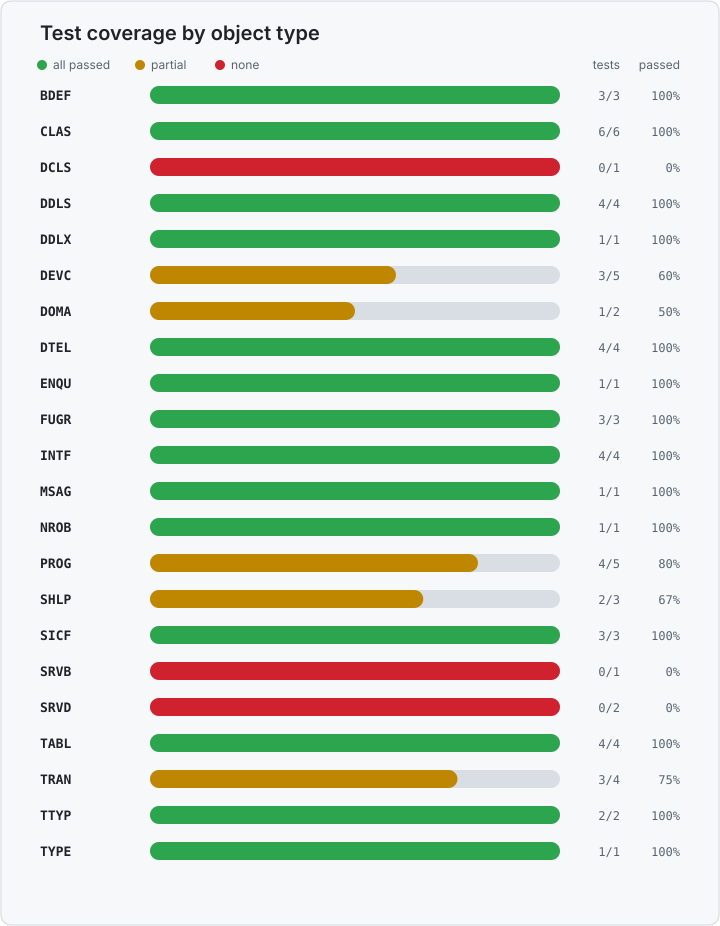

# Dependency Recognition

TRM automatically detects dependencies required by objects in a TRM package, helping prevent syntax and runtime errors.

Dependency detection depends on the object types contained in the package. If support for another object type is required, open an [incident](../incidents.md).

## SAP objects

When TRM identifies a dependency on an object in a **standard SAP package**, it records the requirement in the **TADIR SAP entries**. This manages references to standard objects without bundling SAP-owned code.

## Objects containing ABAP source code

Some repository objects, such as classes, function modules, programs, and includes, contain ABAP source code.

Some ABAP dependencies are not detected by syntax checks when a referenced object is missing or inactive. These issues may surface only at runtime, particularly with dynamic calls or string-based object references.

The following table lists objects and scenarios in which TRM can still detect these dependencies:

| Object Type | Description | Usage |
| ----------- | ----------- | ----- |
| NROB | Number Range Object | When referenced through function module `NUMBER_GET_NEXT` |
| DOCV | Documentation (independent) | Type `DT`: when referenced through function module `POPUP_DISPLAY_TEXT` |

## Supported object types

| Object Type | Dependency Detection |
| --- | --- |
| `BDEF` | <ul><li>Root-entity dependency.</li><li>Persistent-table dependency.</li><li>Behavior-pool dependency.</li></ul> |
| `CLAS` | <ul><li>Superclass inheritance dependency.</li><li>Interface implementation dependency.</li><li>DDIC method-signature dependency.</li><li>Static method-call dependency.</li><li>Number-range dependency through a function-module parameter.</li><li>Dialog-text dependency through a function-module parameter.</li></ul> |
| `DDLS` | <ul><li>Table data-source dependency.</li><li>CDS data-source dependency.</li><li>Table association dependency.</li><li>Multiple table dependencies through an inner join.</li></ul> |
| `DDLX` | <ul><li>Metadata-extension target dependency.</li></ul> |
| `DTEL` | <ul><li>Domain dependency.</li><li>Class reference-type dependency.</li><li>Data-element reference-type dependency.</li><li>Attached search-help dependency.</li></ul> |
| `ENQU` | <ul><li>Primary-table dependency with activation-generated lock modules.</li></ul> |
| `FUGR` | <ul><li>DDIC function-module-interface dependency.</li><li>Static method-call dependency.</li><li>Cross-function-group call dependency.</li></ul> |
| `INTF` | <ul><li>Interface inclusion dependency.</li><li>DDIC method-parameter dependency.</li><li>Class reference-type dependency.</li><li>Class-based exception dependency.</li></ul> |
| `MSAG` | <ul><li>Object without any possible dependency</li></ul> |
| `NROB` | <ul><li>Number-length domain dependency.</li></ul> |
| `SICF` | <ul><li>HTTP handler-class dependency.</li><li>Service alias/reference dependency.</li><li>Parent-child service hierarchy dependency.</li></ul> |
| `TABL` | <ul><li>Field data-element dependency.</li><li>Included-structure dependency.</li><li>Foreign-key/check-table dependency.</li><li>Field-level search-help dependency.</li></ul> |
| `TTYP` | <ul><li>Structured row-type dependency.</li><li>Elementary row-type dependency.</li></ul> |
| `TYPE` | <ul><li>Object without any possible dependency</li></ul> |
