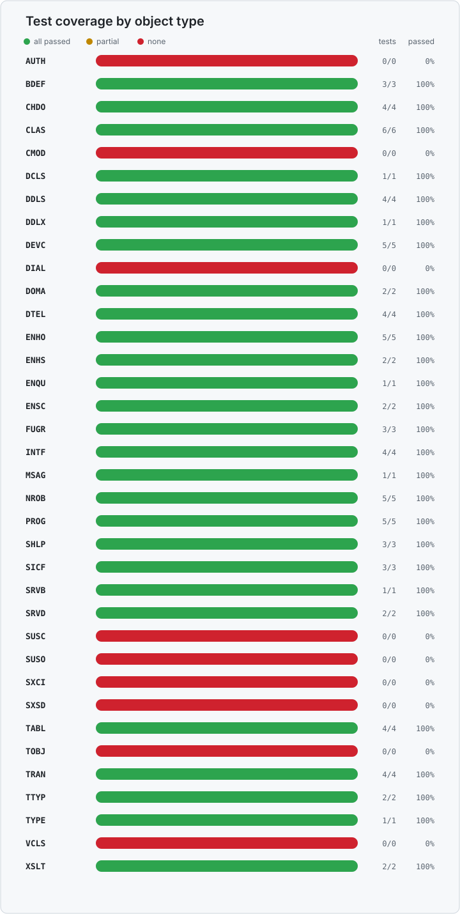

# Dependency Recognition

TRM automatically detects dependencies required by objects in a TRM package, helping prevent syntax and runtime errors.

Dependency detection depends on the object types contained in the package. If support for another object type is required, open an [incident](../incidents.md).

## SAP objects

When TRM identifies a dependency on an object in a **standard SAP package**, it records the requirement in the **TADIR SAP entries**. This manages references to standard objects without bundling SAP-owned code.

## Objects containing ABAP source code

Some repository objects, such as classes, function modules, programs, and includes, contain ABAP source code.

Some ABAP dependencies are not detected by syntax checks when a referenced object is missing or inactive. These issues may surface only at runtime, particularly with dynamic calls or string-based object references.

The following table lists objects and scenarios in which TRM can still detect these dependencies:

| Object Type | Description | Usage |
| ----------- | ----------- | ----- |
| NROB | Number Range Object | When referenced through function module `NUMBER_GET_NEXT` |
| DOCV | Documentation (independent) | Type `DT`: when referenced through function module `POPUP_DISPLAY_TEXT` |

## Supported object types

Dependency detection status reflects behavior in `trm-server >= 7.0.0`; SAP test baseline: `SAP_BASIS 758` SP02, `SAP_ABA 75I` SP02, `S4FND 108` SP02.

| Object Type | Dependency Detection |
| --- | --- |
| `AUTH` | <ul><li>Field data element dependency.</li><li>Check table dependency.</li></ul> |
| `BDEF` | <ul><li>Root-entity dependency.</li><li>Persistent-table dependency.</li><li>Behavior-pool dependency.</li></ul> |
| `CHDO` | <ul><li>Maintained table dependency detected.</li><li>Reference table dependency detected.</li><li>Generated update function group detected.</li><li>Generated writer class detected.</li></ul> |
| `CLAS` | <ul><li>Superclass inheritance dependency.</li><li>Interface implementation dependency.</li><li>DDIC method-signature dependency.</li><li>Static method-call dependency.</li><li>Number-range dependency through a function-module parameter.</li><li>Dialog-text dependency through a function-module parameter.</li></ul> |
| `CMOD` | <ul><li>Assigned SAP enhancement dependency.</li></ul> |
| `DCLS` | <ul><li>Protected CDS target dependency detected.</li></ul> |
| `DDLS` | <ul><li>Table data-source dependency.</li><li>CDS data-source dependency.</li><li>Table association dependency.</li><li>Multiple table dependencies through an inner join.</li></ul> |
| `DDLX` | <ul><li>Metadata-extension target dependency.</li></ul> |
| `DEVC` | <ul><li>Superpackage dependency.</li><li>Package-interface use-access dependency.</li><li>Application-component dependency.</li><li>Switch-assignment dependency.</li><li>Default-package-interface dependency.</li></ul> |
| `DIAL` | <ul><li>Module pool program dependency.</li><li>Interface parameter reference table dependency.</li></ul> |
| `DOMA` | <ul><li>Value-table dependency.</li><li>Conversion-routine function-group dependency.</li><li>Conversion-routine input-function dependency.</li></ul> |
| `DTEL` | <ul><li>Domain dependency.</li><li>Class reference-type dependency.</li><li>Data-element reference-type dependency.</li><li>Attached search-help dependency.</li></ul> |
| `ENHC` | <ul><li>Member enhancement implementation dependency.</li><li>Nested composite enhancement implementation dependency.</li></ul> |
| `ENHO` | <ul><li>BAdI spot assignment is reported.</li><li>BAdI interface contract is reported.</li><li>Implementation class is reported.</li><li>Explicit enhancement spot is reported.</li><li>Explicit enhancement program is reported.</li></ul> |
| `ENHS` | <ul><li>BAdI interface contract is reported.</li><li>Fallback class is reported.</li></ul> |
| `ENQU` | <ul><li>Primary-table dependency with activation-generated lock modules.</li></ul> |
| `ENSC` | <ul><li>Child enhancement spot dependency detected.</li><li>Nested composite enhancement spot dependency detected.</li></ul> |
| `FUGR` | <ul><li>DDIC function-module-interface dependency.</li><li>Static method-call dependency.</li><li>Cross-function-group call dependency.</li></ul> |
| `IDOC` | <ul><li>Segment type dependency.</li><li>Predecessor basic type dependency.</li></ul> |
| `IEXT` | <ul><li>Extended basic type dependency.</li><li>Extension segment type dependency.</li><li>Predecessor extension dependency.</li></ul> |
| `INTF` | <ul><li>Interface inclusion dependency.</li><li>DDIC method-parameter dependency.</li><li>Class reference-type dependency.</li><li>Class-based exception dependency.</li></ul> |
| `IWMO` | <ul><li>Model provider class dependency.</li></ul> |
| `IWPR` | <ul><li>Entity type DDIC structure dependency.</li><li>CDS business entity data source dependency.</li><li>Generated model provider class dependency.</li><li>Generated model provider extension class dependency.</li><li>Generated data provider class dependency.</li><li>Generated data provider extension class dependency.</li><li>Generated technical model dependency.</li><li>Generated technical service dependency.</li><li>Included OData service dependency.</li></ul> |
| `IWSV` | <ul><li>Data provider class dependency.</li><li>Assigned technical model dependency.</li></ul> |
| `MSAG` | <ul><li>Object without any possible dependency</li></ul> |
| `NROB` | <ul><li>Number-length domain dependency.</li><li>Subobject data-element dependency.</li><li>Group-table dependency.</li><li>Element text-table dependency.</li><li>Populated-interval number-length domain dependency.</li></ul> |
| `PROG` | <ul><li>DDIC type dependency.</li><li>Static method-call dependency.</li><li>Function-module call dependency.</li><li>Executable-program submission dependency.</li><li>Source-include dependency.</li></ul> |
| `SAMC` | <ul><li>Authorized program dependency.</li><li>Authorized class dependency.</li></ul> |
| `SAPC` | <ul><li>Generated handler class dependency.</li><li>Generated ICF service dependency.</li></ul> |
| `SFPI` | <ul><li>Import parameter structure dependency.</li><li>Import parameter data element dependency.</li><li>Global data table type dependency.</li><li>Code initialization function group dependency.</li><li>Code initialization function module dependency.</li></ul> |
| `SHLP` | <ul><li>Selection-method dependency.</li><li>Parameter data-element dependency.</li><li>Included search-help dependency.</li></ul> |
| `SICF` | <ul><li>HTTP handler-class dependency.</li><li>Service alias/reference dependency.</li><li>Parent-child service hierarchy dependency.</li></ul> |
| `SOBJ` | <ul><li>Implementing program dependency.</li><li>Key field reference table dependency.</li><li>Implemented interface type dependency.</li><li>Object-reference attribute type dependency.</li><li>Method function group dependency.</li><li>Method function module dependency.</li><li>Method parameter reference table dependency.</li><li>Method exception message class dependency.</li><li>Supertype dependency.</li></ul> |
| `SRVB` | <ul><li>Bound service definition dependency detected.</li></ul> |
| `SRVD` | <ul><li>Primary exposed CDS entity dependency detected.</li><li>Dependent exposed CDS entity dependency detected.</li></ul> |
| `SSFO` | <ul><li>Smart Style dependency.</li><li>Interface parameter structure dependency.</li><li>Interface parameter data element dependency.</li><li>Program-lines function group dependency.</li><li>Program-lines function module dependency.</li><li>Global data table type dependency.</li><li>Global data class reference dependency.</li><li>Text module dependency.</li></ul> |
| `SSST` | <ul><li>Object without any possible dependency</li></ul> |
| `SUSC` | <ul><li>Object without any possible dependency</li></ul> |
| `SUSO` | <ul><li>Authorization field dependency.</li><li>Authorization object class dependency.</li><li>Object field search help dependency.</li></ul> |
| `SXCI` | <ul><li>Implemented BAdI definition dependency.</li><li>Implementing class dependency.</li><li>Subscreen implementing program dependency.</li><li>Migration enhancement implementation dependency.</li></ul> |
| `SXSD` | <ul><li>BAdI interface dependency.</li><li>Generated adapter class dependency.</li><li>Filter type data element dependency.</li><li>Default implementation class dependency.</li><li>Example implementation class dependency.</li><li>Filter type structure dependency.</li><li>Menu enhancement program dependency.</li><li>Screen enhancement calling program dependency.</li><li>Migration enhancement spot dependency.</li></ul> |
| `TABL` | <ul><li>Field data-element dependency.</li><li>Included-structure dependency.</li><li>Foreign-key/check-table dependency.</li><li>Field-level search-help dependency.</li></ul> |
| `TOBJ` | <ul><li>Piece-list table content dependency.</li><li>Object method function group dependency.</li><li>Object method function module dependency.</li><li>Maintained table dependency.</li><li>Generated maintenance function group dependency.</li><li>View cluster dependency.</li><li>Maintenance view dependency.</li><li>Individual transaction dependency.</li><li>Multiclient-compliance document dependency.</li></ul> |
| `TRAN` | <ul><li>Report-transaction program dependency.</li><li>Parameter-transaction dependency.</li><li>OO-transaction class dependency.</li><li>Dialog program/dynpro dependency.</li></ul> |
| `TTYP` | <ul><li>Structured row-type dependency.</li><li>Elementary row-type dependency.</li></ul> |
| `TYPE` | <ul><li>Object without any possible dependency</li></ul> |
| `VCLS` | <ul><li>Header member table dependency.</li><li>Dependent member table dependency.</li><li>Generated transport object dependency.</li><li>Event FORM routine program dependency.</li><li>Member switch dependency.</li><li>Maintenance view member dependency.</li><li>Base view cluster dependency.</li></ul> |
| `XSLT` | <ul><li>Included transformation dependency detected.</li><li>Typed DDIC root dependency detected.</li></ul> |
