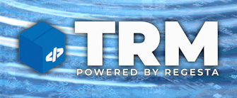

# 🚚 TRM - Transport Request Manager

| 🚀 This project is funded and maintained by 🏦  | 🔗                                                             |
|-------------------------------------------------|----------------------------------------------------------------|
| Regesta Group Srl                               | [https://www.regestaitalia.eu/](https://www.regestaitalia.eu/) |
| Clarex Srl                                      | [https://www.clarex.it/](https://www.clarex.it/)               |

**TRM (Transport Request Manager)** is the package manager for SAP systems.

  

TRM introduces **package-based software delivery** to the SAP ecosystem, bringing with it semantic versioning, dependency management, and automated deployment activities.

---

# What is TRM?

TRM is software that transforms how custom ABAP developments are published, installed, and maintained across SAP landscapes.
Inspired by modern package managers, TRM introduces a declarative, version-controlled, and automated way to manage your SAP transports.

With TRM, you can:

- **Define a manifest** for each ABAP package (similar to `package.json` with Node.js or `pom.xml` with Maven)
- **Version your products** ([SemVer](https://semver.org/) compliance)
- **Declare dependencies** (to other TRM packages, SAP standard objects, or customizing data)
- **Automate post-install activities**, such as client-dependent customizing and cache invalidation
- **Validate system requirements** prior to installation
- **Compare versions** of the same product across multiple SAP systems (in or outside the same landscape)
- **Distribute** your product release to the public or to a restricted number of users:
  - Registry (e.g., [trmregistry.com](https://trmregistry.com) or private registry)
  - Local `.trm` files for offline installations

## Modern approach for ABAP

- Publish ABAP packages from a **central development system**
- Deliver packages to target systems (outside the original landscape, such as a customer's development system) using a single CLI command or pipeline
- Full support for **workbench objects**, **customizing**, and **translations**

## Structured Manifest

Each package includes a `manifest.json` that declares:

- Version and metadata
- System requirements
- Dependencies
- Post-install scripts

---

# Architecture Overview

- [**Server**](https://github.com/RegestaItalia/trm-server): Collection of APIs installed on source and destination systems
- [**Client**](https://github.com/RegestaItalia/trm-client): Command-line interface that talks with SAP instances
- [**Registry**](https://trmregistry.com/): Cloud registry where package releases are safely stored for end users to install

---

# Contributors

Like every other TRM open-source project, we always welcome contributions ❤️.

Make sure to open an issue first.

Contributions will be merged upon approval.

[Read the contribution guidelines](CONTRIBUTING.md) before submitting a change.

  
  <iframe class="contributors-embed__iframe" src="https://trmregistry.com/public/contributors" title="TRM project contributors" loading="lazy" scrolling="no"></iframe>

